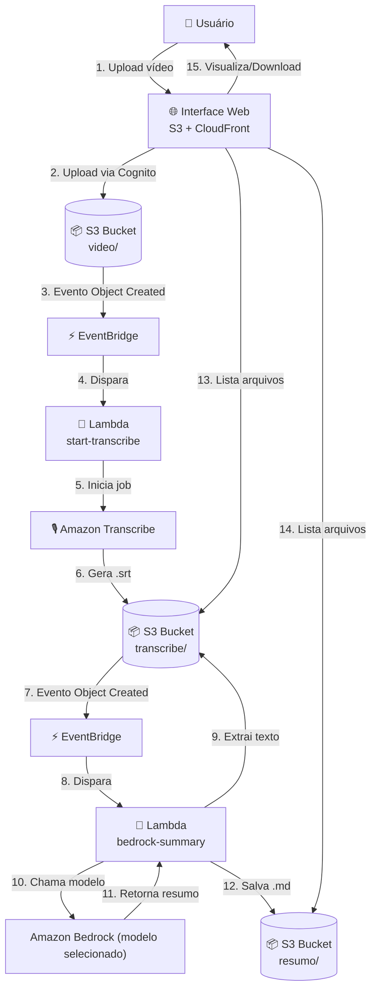
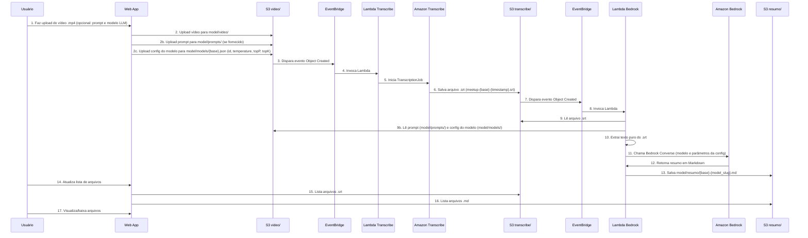

git # AWS Community - Pipeline de Transcrição e Resumo Automatizado

Sistema completo para processamento automatizado de vídeos que gera transcrições e resumos usando serviços da AWS. O projeto permite upload de vídeos através de uma interface web (com acesso opcional por token), processamento automático via Amazon Transcribe e geração de resumos em Markdown via Amazon Bedrock, com seleção de modelo LLM e parâmetros por vídeo. É possível gerar múltiplos resumos por vídeo (um por modelo) e reprocessar com outro modelo sem reenviar o vídeo.

## 📋 Índice

- [Visão Geral](#visão-geral)
- [Arquitetura](#arquitetura)
- [Fluxo de Dados](#fluxo-de-dados)
- [Componentes](#componentes)
- [Requisitos](#requisitos)
- [Estrutura do Projeto](#estrutura-do-projeto)
- [Configuração](#configuração)
- [Deploy](#deploy)
- [Uso](#uso)
- [Scripts Disponíveis](#scripts-disponíveis)
- [Apresentação](#apresentação)

## 🎯 Visão Geral

Este projeto automatiza o processamento completo de vídeos educacionais e palestras:

1. **Acesso opcional por token**: Página pode ser protegida com token (configurável em `ACCESS_TOKEN`); acesso via `?token=...` ou tela de login.
2. **Upload de Vídeos**: Interface web para upload de arquivos `.mp4`
3. **Prompt Personalizado**: Opção de enviar prompt customizado (`.txt` ou `.md`) para personalizar os resumos
4. **Seleção de modelo LLM**: Escolha do modelo no upload (ex.: Claude Haiku 4.5, Amazon Nova Lite, DeepSeek R1); parâmetros por modelo (temperature, topP, topK) em `app/models.json`
5. **Transcrição Automática**: Geração de legendas `.srt` via Amazon Transcribe
6. **Resumo Inteligente**: Geração de resumos em Markdown via Amazon Bedrock (modelo escolhido pelo usuário)
7. **Múltiplos resumos por vídeo**: Um arquivo `.md` por modelo (ex.: `{video}-haiku45.md`, `{video}-Novalt.md`, `{video}-DSeekR1.md`)
8. **Reprocessamento com outro modelo**: Com vídeo e legenda já existentes, basta selecionar outro modelo e enviar; o app dispara apenas a geração de um novo resumo (sem nova transcrição)
9. **Interface Web Moderna**: Visualização avançada de Markdown com suporte a tabelas, diagramas Mermaid e syntax highlighting

## 🏗️ Arquitetura

O sistema utiliza uma arquitetura serverless na AWS, composta por:

- **Frontend**: Aplicação web estática hospedada no S3 e distribuída via CloudFront
- **Autenticação**: Cognito Identity Pool para acesso não autenticado ao S3
- **Processamento**: Funções Lambda acionadas por eventos do S3
- **IA/ML**: Amazon Transcribe para transcrição e Amazon Bedrock para resumos
- **Armazenamento**: S3 para vídeos, transcrições e resumos
- **Orquestração**: EventBridge para coordenação de eventos

### Diagrama de Arquitetura



## 🔄 Fluxo de Dados

### Fluxo Completo



**Cenário alternativo (reprocessar com outro modelo):** Se vídeo e legenda canônica já existirem, o app não reenvia o vídeo; faz copy do `.srt` com `MetadataDirective: REPLACE` (metadata de trigger) para disparar apenas a Lambda Bedrock, que lê a nova config do modelo em `model/models/{base}.json` e gera um novo resumo `{base}-{model_slug}.md`.

## 🧩 Componentes

### Frontend (Interface Web)

- **Localização**: `app/`
- **Tecnologias**: HTML5, CSS3, JavaScript (Vanilla)
- **Bibliotecas Externas**:
  - **Marked.js**: Renderização de Markdown
  - **Highlight.js**: Syntax highlighting para blocos de código
  - **DOMPurify**: Sanitização de HTML para segurança
  - **Mermaid.js**: Renderização de diagramas Mermaid
- **Hospedagem**: S3 + CloudFront
- **Layout**: Sidebar vertical à esquerda com preview à direita
- **Design**: Paleta monocromática (preto/cinza/branco)
- **Funcionalidades**:
  - **Token de acesso**: Se `config.json` tiver `accessToken`, exibe tela de acesso; validação por `?token=...` na URL ou campo na tela; valor válido armazenado em `sessionStorage`; sem token = acesso livre
  - Upload de vídeos `.mp4` via Cognito Identity Pool
  - Upload de prompt personalizado (`.txt` ou `.md`) - opcional
  - **Seletor de modelo LLM**: Lista carregada de `app/models.json` (id, name, temperature, topP, topK); valor enviado no upload como `model/models/{baseName}.json`
  - **Reuso de vídeo/legenda**: Se vídeo e legenda canônica existirem (ETag em `model/transcribe/{base}.video-etag` conferido), não reenvia vídeo; faz copy da legenda com metadata para disparar apenas a geração de novo resumo (ex.: com outro modelo)
  - Listagem de transcrições `.srt` e resumos `.md` (podem existir vários `.md` por vídeo, um por modelo)
  - Visualização avançada de Markdown com:
    - Suporte a GitHub Flavored Markdown (tabelas, task lists)
    - Diagramas Mermaid (flowcharts, sequence, gantt, etc.)
    - Syntax highlighting para código
    - Renderização de tabelas responsivas
  - Download e exclusão de arquivos (transcrições e resumos)
  - Modo claro/escuro
  - Botões de ação (Atualizar, Dark Mode)

### Backend (Serverless)

#### Lambda: `start-transcribe-on-s3-upload`
- **Trigger**: EventBridge (quando arquivo `.mp4` é criado em `video/`)
- **Função**: Inicia job de transcrição no Amazon Transcribe
- **Output**: Arquivo `.srt` salvo em `transcribe/`

#### Lambda: `generate-summary-from-srt-bedrock`
- **Trigger**: EventBridge (quando arquivo `.srt` é criado em `model/transcribe/`)
- **Entrada**: Evento S3 Object Created; processa apenas keys que terminam em `.srt`
- **Leitura de config do modelo**: `model/models/{baseName}.json` (id, temperature, topP, topK) ou fallback `model/models/{baseName}.txt` (só id) e defaults
- **Prompt**: Guardrails (`guardrails.md` empacotado na Lambda) + prompt opcional por vídeo (`model/prompts/{base}.txt`)
- **Inference**: Uso de inference profile quando aplicável (Claude Haiku 4.5, Nova Lite, DeepSeek R1); parâmetros por modelo (ex.: Claude Haiku só temperature, sem topP)
- **Saídas**:
  - Resumo em `model/resumo/{video_base_name}-{model_slug}.md` (ex.: haiku45, Novalt, DSeekR1)
  - **Legenda canônica**: Grava `model/transcribe/{video_base_name}.srt`; remove o arquivo original `meetup-*-timestamp.srt` para evitar duplicata na listagem
  - Arquivo `model/transcribe/{base}.video-etag` com o ETag do vídeo para o frontend validar se a legenda ainda corresponde ao vídeo
- **Build**: O artefato inclui `prompt/guardrails.md` (copiado no `build_lambdas.sh`)

### Infraestrutura AWS

- **S3 Bucket único** (`var.bucket_name`):
  - `app/`: Frontend estático
  - `model/`: Vídeos, transcrições, resumos, prompts e config do modelo
    - `model/video/`: Arquivos de vídeo `.mp4`
    - `model/transcribe/`: Transcrições `.srt` (legenda canônica por vídeo), arquivo `.video-etag` por vídeo
    - `model/resumo/`: Resumos `.md` (um por modelo: `{base}-{model_slug}.md`)
    - `model/prompts/`: Prompts personalizados `.txt` (opcional)
    - `model/models/`: Config do modelo por vídeo — JSON com `id`, `temperature`, `topP`, `topK` (ou `.txt` apenas com id)
  - `tfvars/`: State do Terraform
- **CloudFront**: CDN para distribuição do frontend
- **Route53**: DNS para domínio personalizado
- **ACM**: Certificado SSL/TLS
- **Cognito Identity Pool**: Autenticação para acesso ao S3
- **EventBridge**: Orquestração de eventos
- **Log groups (Terraform)**: Criados explicitamente para as duas Lambdas (`/aws/lambda/start-transcribe-on-s3-upload`, `/aws/lambda/generate-summary-from-srt-bedrock`) com retenção configurável (`log_retention_days`)
- **Bedrock Model Invocation Logging**: Configurado no Terraform — CloudWatch (`/aws/bedrock/model-invocation-logs`) e S3 para dados >100KB (bucket auxiliar)
- **IAM**: Políticas de permissão

## 📋 Requisitos

### Pré-requisitos

- **AWS CLI** configurado com credenciais válidas
- **Terraform** >= 1.6.0
- **Python** 3.12 (para desenvolvimento local)
- **Bash** (para scripts de deploy)
- **Conta AWS** com permissões para criar recursos

### Permissões AWS Necessárias

- Criar e gerenciar buckets S3
- Criar e gerenciar funções Lambda
- Criar e gerenciar EventBridge rules
- Criar e gerenciar Cognito Identity Pools
- Criar e gerenciar CloudFront distributions
- Criar e gerenciar Route53 records
- Acessar Amazon Transcribe
- Acessar Amazon Bedrock (com acesso aos modelos desejados: Claude Haiku 4.5, Amazon Nova Lite, DeepSeek R1, etc.)

### Configuração do Bedrock

1. Acesse o console do Amazon Bedrock (região us-east-2)
2. Em **Model access**, solicite acesso aos modelos que pretende usar (ex.: Claude Haiku 4.5, Amazon Nova Lite, DeepSeek R1)
3. Para modelos com inference profile (DeepSeek R1, Nova Lite, Claude Haiku 4.5), a Lambda usa os profiles automaticamente; verifique disponibilidade na região

### Backend Terraform (state remoto)

O state do Terraform é armazenado em S3:

- **Bucket**: definido em `config/config.env` (BUCKET_NAME)
- **Path**: `tfvars/meetup/terraform.tfstate`

Antes do primeiro `terraform init`, crie o bucket (se não existir):

```bash
bash script/setup-terraform-backend.sh
```

O script aplica as mesmas práticas de segurança do projeto:
- **Block Public Access**: nenhum acesso público (state pode conter dados sensíveis)
- **Criptografia SSE-S3** (AES256)
- **Versionamento** (recuperação de state)

O `create-all.sh` executa esse passo automaticamente.

**Migração de state local para S3**: Se você já tem state local (`terraform.tfstate`), execute `terraform init` e responda `yes` quando perguntado sobre migrar o state existente.

## 📁 Estrutura do Projeto

```
meetup/
├── app/                          # Frontend estático
│   ├── index.html               # Página principal
│   ├── app.js                   # Lógica JavaScript
│   ├── models.json              # Lista de modelos Bedrock para o seletor
│   ├── styles.css               # Estilos CSS
│   ├── error.html               # Página de erro 404
│   └── assets/                 # Assets estáticos (se houver)
│
├── terraform/                    # Infraestrutura como código
│   ├── main.tf                  # Recursos principais (backend S3 configurado via config/config.env)
│   ├── variables.tf             # Variáveis
│   ├── outputs.tf               # Outputs (identity_pool_id, buckets, cloudfront_distribution_id)
│   ├── terraform.tfvars         # Valores (não versionado)
│   ├── lambda/
│   │   ├── lambda_function.py   # Lambda de transcrição
│   │   └── lambda_bedrock_summary.py  # Lambda de resumo
│   └── build/                   # ZIPs das Lambdas (gerados por build_lambdas.sh)
│
├── config/                       # Configurações centralizadas
│   ├── config.env.example       # Exemplo para create-all (DOMAIN_NAME, BUCKET_NAME, etc.)
│   ├── config.json.example      # Exemplo para app (identityPoolId, bucket)
│   └── backend.tfbackend.example # Exemplo para backend Terraform (bucket, region)
│
├── script/                       # Scripts de automação
│   ├── create-all.sh           # Cria TUDO do zero (ACM, IAM, Terraform, app)
│   ├── destroy-all.sh          # Destrói TUDO (Terraform, ACM, IAM)
│   ├── setup-terraform-backend.sh # Cria bucket S3 para state (BUCKET_NAME de config.env)
│   ├── setup-acm-certificate.sh # Cria certificado ACM (us-east-1) via AWS CLI
│   ├── setup-iam-prereqs.sh     # Cria usuário IAM opcional para deploy
│   ├── update_app_config.sh    # Atualiza app.js com outputs do Terraform
│   ├── build_lambdas.sh         # Empacota as Lambdas
│   ├── terraform_deploy.sh      # terraform init + apply + update_app_config
│   └── deploy_app.sh            # Sync S3 + invalidação CloudFront (ID via Terraform)
│
├── prompt/                      # Prompts e guardrails para resumos
│   ├── prompt.md                # Exemplo de prompt personalizado
│   └── guardrails.md            # Regras obrigatórias (empacotado na Lambda)
│
├── .gitignore
├── README.md
└── PRESENTATION.md              # Base para apresentação do projeto
```

## ⚙️ Configuração

### 0. Configuração para create-all.sh (fluxo simplificado)

Se usar `create-all.sh`, crie o arquivo de configuração:

```bash
cp config/config.env.example config/config.env
```

Edite `config/config.env` e defina pelo menos:
- `DOMAIN_NAME` – domínio do site (ex: example.com)
- `BUCKET_NAME` – nome do bucket S3 (globalmente único)
- `HOSTED_ZONE_ID` – ID da hosted zone no Route53 (ou deixe vazio para descoberta automática)

Opcional: `ACCESS_TOKEN` (vazio = acesso livre; preenchido = exige token na URL `?token=...` ou na tela de acesso), `CREATE_ACM=1`, `CREATE_IAM_USER=0`, variáveis de Bedrock e observabilidade. Veja `config/config.env.example` para todas as opções.

### 1. Pré-requisitos AWS (opcional: scripts com AWS CLI)

Para simplificar a criação da infraestrutura, use os scripts que criam certificado e usuário IAM via AWS CLI:

**Certificado ACM (obrigatório para HTTPS no CloudFront)**  
O certificado deve estar em **us-east-1**. Com domínio e hosted zone no Route53:

```bash
export DOMAIN_NAME="example.com"
export HOSTED_ZONE_ID="Z1234567890ABC"   # ID da hosted zone do domínio
bash script/setup-acm-certificate.sh
```

O script exibe o `acm_certificate_arn`; adicione-o no `terraform.tfvars`. Se não usar `HOSTED_ZONE_ID`, valide o certificado manualmente no console ACM.

**Usuário IAM para deploy (opcional)**  
Para um usuário dedicado com permissões de deploy:

```bash
export DEPLOY_USER_NAME="aws-meetup-deploy"
bash script/setup-iam-prereqs.sh
```

Depois crie uma Access Key no console IAM e use `aws configure`.

### 2. Variáveis do Terraform

Crie `terraform/terraform.tfvars`:

```hcl
aws_region         = "us-east-2"
bucket_name        = "your-bucket-name"   # De config/config.env (BUCKET_NAME)
domain_name        = "example.com"        # De config/config.env (DOMAIN_NAME)
acm_certificate_arn = "arn:aws:acm:us-east-1:ACCOUNT_ID:certificate/CERT_ID"  # Saída do setup-acm-certificate.sh
hosted_zone_id     = "Z1234567890ABC"     # ID da hosted zone no Route53

bedrock_region            = "us-east-2"
bedrock_model_id          = "anthropic.claude-haiku-4-5-20251001-v1:0"
bedrock_inference_profile = ""   # Preencher para DeepSeek R1: "us.deepseek.r1-v1:0"
bedrock_logs_retention_days = 30 # Retenção dos logs do Bedrock no CloudWatch (dias). 0 = indefinido
```

### 3. Configuração do Frontend

Após `terraform apply`, o script `update_app_config.sh` (executado por `terraform_deploy.sh` ou `deploy_app.sh`) gera o `config/config.json` com `identityPoolId`, `region`, `videoBucket` e `accessToken` (a partir de `ACCESS_TOKEN` em `config/config.env`). O deploy copia para `app/config.json` e o `app.js` carrega em runtime. Se fizer deploy manual, rode:

```bash
bash script/update_app_config.sh
```

Para desenvolvimento local sem deploy, crie `config/config.json` manualmente (use `config/config.json.example` como base).

## 🚀 Deploy

### Opção 1: Deploy do zero (recomendado)

Um único fluxo cria certificado ACM, IAM (opcional), Terraform e frontend:

```bash
# 1. Copiar e editar a configuração
cp config/config.env.example config/config.env
nano config/config.env   # Preencha DOMAIN_NAME e HOSTED_ZONE_ID (ou deixe vazio para descoberta automática)

# 2. Criar tudo
bash script/create-all.sh
```

O `create-all.sh`:
- Descobre `HOSTED_ZONE_ID` automaticamente (se vazio e domínio no Route53)
- Cria certificado ACM via AWS CLI e valida via DNS
- Cria usuário IAM opcional para deploy
- Gera `terraform.tfvars`, faz build das Lambdas, Terraform apply e deploy do app

**Para destruir tudo** (Terraform, ACM, IAM criados pelo create-all):

```bash
bash script/destroy-all.sh
# Digite 'sim' para confirmar
# Ou: AUTO_APPROVE=1 bash script/destroy-all.sh
```

### Opção 2: Deploy manual (passo a passo)

#### 1. Build das Lambdas

```bash
bash script/build_lambdas.sh
```

Este script:
- Cria o diretório `terraform/build/` se não existir
- Empacota as funções Lambda em arquivos ZIP

#### 2. Deploy da Infraestrutura

```bash
bash script/terraform_deploy.sh
```

Ou manualmente (requer `config/config.env` e `config/backend.tfbackend`):

```bash
# 1. Copie e edite backend.tfbackend com bucket/region de config.env
cp config/backend.tfbackend.example config/backend.tfbackend
# Edite config/backend.tfbackend com BUCKET_NAME e AWS_REGION

# 2. Init e apply
cd terraform
terraform init -backend-config=../config/backend.tfbackend
terraform plan
terraform apply
```

O script `terraform_deploy.sh` já roda `update_app_config.sh` ao final, atualizando o `app.js` com `identity_pool_id` e nome do bucket.

#### 3. Deploy do Frontend

```bash
bash script/deploy_app.sh
```

Este script obtém o bucket do app e o ID do CloudFront dos outputs do Terraform, faz sync do `app/` para o S3 e invalida o cache do CloudFront. Execute `terraform apply` antes da primeira vez.

## 💻 Uso

### Acessando a Interface

Após o deploy, acesse o site através do domínio configurado (ex: `https://example.com`). Se o acesso por token estiver configurado (`ACCESS_TOKEN` em config), use `?token=seu-token` na URL ou informe o token na tela de acesso.

### Upload de Vídeo

1. Clique em "Choose File" e selecione um arquivo `.mp4`
2. (Opcional) Selecione um arquivo de prompt personalizado (`.txt` ou `.md`)
3. **Selecione o modelo LLM** no dropdown (ex.: Claude Haiku 4.5, Amazon Nova Lite, DeepSeek R1); a config (id, temperature, topP, topK) é enviada para `model/models/{nome_do_video}.json`
4. Clique em "Enviar"
5. Aguarde a confirmação de upload

### Processamento Automático

O processamento acontece automaticamente:

1. **Transcrição** (alguns minutos):
   - O vídeo é processado pelo Amazon Transcribe
   - Arquivo `.srt` é gerado; a Lambda Bedrock grava a legenda canônica em `model/transcribe/{base}.srt` e remove o arquivo temporário `meetup-*-timestamp.srt`

2. **Resumo** (alguns minutos após a transcrição):
   - O texto é extraído do `.srt`
   - A Lambda lê o prompt (se existir em `model/prompts/`) e a config do modelo em `model/models/`
   - Resumo é gerado pelo Amazon Bedrock com o modelo e parâmetros selecionados
   - Arquivo `.md` é salvo em `model/resumo/{base}-{model_slug}.md` (ex.: `CommunityDayCPS-haiku45.md`, `CommunityDayCPS-Novalt.md`)

### Reprocessar com outro modelo

Para gerar um novo resumo com outro modelo usando o mesmo vídeo e prompt: selecione o mesmo vídeo (e prompt, se quiser manter), **escolha outro modelo LLM** e clique em "Enviar". Se o vídeo e a legenda canônica já existirem, o app não reenvia o vídeo; dispara apenas a geração de um novo resumo (novo arquivo `.md` com o slug do modelo selecionado).

### Prompt Personalizado

Você pode personalizar os resumos enviando um arquivo de prompt junto com o vídeo:

- **Formato**: Arquivo de texto (`.txt` ou `.md`)
- **Nome**: O arquivo será salvo como `{nome_do_video}.txt` no bucket
- **Uso**: O prompt será usado como instrução para o modelo de IA ao gerar o resumo
- **Exemplo**: Use `prompt/prompt.md` como base. Um prompt pode instruir o modelo a focar em pontos técnicos, criar seções específicas, ou usar um formato particular

**Nota**: Se nenhum prompt for enviado, o sistema usa o `prompt/guardrails.md` (regras obrigatórias) como base.

### Visualização

1. Use as abas "Transcrições (.srt)" e "Resumos (.md)" para alternar entre os tipos
2. Pode haver **vários resumos por vídeo** (um por modelo), ex.: `CommunityDayCPS-haiku45.md`, `CommunityDayCPS-Novalt.md`
3. Clique em um arquivo para visualizar o conteúdo
4. Os resumos Markdown suportam:
   - **Tabelas**: Renderização completa de tabelas GitHub Flavored Markdown
   - **Diagramas Mermaid**: Flowcharts, sequence diagrams, Gantt charts, etc.
   - **Syntax Highlighting**: Código com destaque de sintaxe
   - **Task Lists**: Listas de tarefas interativas
5. Use o botão "Baixar arquivo" para fazer download

## 🛠️ Scripts Disponíveis

| Script | Descrição |
|--------|-----------|
| `create-all.sh` | **Cria tudo do zero**: ACM, IAM (opcional), Terraform e deploy do app. Usa `config/config.env`. |
| `destroy-all.sh` | **⚠️ DESTRÓI TUDO**: Terraform, certificado ACM e usuário IAM (se criados pelo create-all). Confirmação digitando `sim`; use `AUTO_APPROVE=1` para pular. |
| `config/config.env.example` | Template de configuração. Copie para `config/config.env` e edite. |
| `setup-terraform-backend.sh` | Cria bucket S3 para state remoto (BUCKET_NAME de config.env). Aplica Block Public Access, criptografia SSE-S3 e versionamento. Execute antes do primeiro `terraform init`. |
| `setup-acm-certificate.sh` | Cria certificado ACM em us-east-1 (variáveis: `DOMAIN_NAME`, opcional `HOSTED_ZONE_ID`). |
| `setup-iam-prereqs.sh` | Cria usuário IAM opcional para deploy (variável: `DEPLOY_USER_NAME`). |
| `update_app_config.sh` | Gera `config/config.json` com `identityPoolId`, `region`, `videoBucket` e `accessToken` (a partir dos outputs do Terraform e de `ACCESS_TOKEN` em `config/config.env`). |
| `build_lambdas.sh` | Empacota as Lambdas em ZIP em `terraform/build/`. |
| `terraform_deploy.sh` | `terraform init` + `apply` + `update_app_config.sh`. |
| `deploy_app.sh` | Sync do `app/` para o S3 e invalidação do CloudFront (usa outputs do Terraform). |

Exemplos:

```bash
# Fluxo simplificado (recomendado)
cp config/config.env.example config/config.env
# Edite config/config.env com DOMAIN_NAME e HOSTED_ZONE_ID
bash script/create-all.sh

# Para destruir tudo
bash script/destroy-all.sh
```

Ou deploy manual:

```bash
# Pré-requisitos (certificado e opcionalmente IAM)
DOMAIN_NAME=example.com HOSTED_ZONE_ID=Z... bash script/setup-acm-certificate.sh
DEPLOY_USER_NAME=aws-meetup-deploy bash script/setup-iam-prereqs.sh

# Deploy completo
bash script/build_lambdas.sh
bash script/terraform_deploy.sh
bash script/deploy_app.sh
```

## 📽️ Apresentação

O arquivo [PRESENTATION.md](PRESENTATION.md) contém um **prompt estruturado** para gerar slides em ferramentas como gamma.app: contexto do projeto, arquitetura, componentes, fluxo de dados e instruções de deploy.

## 🔧 Manutenção

### Atualizar Código das Lambdas

1. Edite os arquivos em `terraform/lambda/`
2. Execute `bash script/build_lambdas.sh`
3. Execute `terraform apply` na pasta `terraform/`

### Atualizar Frontend

1. Edite os arquivos em `app/`
2. Se adicionar novos assets, certifique-se de que estão na pasta `app/assets/`
3. Execute `bash script/deploy_app.sh`

### Verificar Logs

```bash
# Logs da Lambda de Transcrição
aws logs tail /aws/lambda/start-transcribe-on-s3-upload --follow

# Logs da Lambda de Resumo (processamento LLM)
aws logs tail /aws/lambda/generate-summary-from-srt-bedrock --follow
```

**Importante:**
- O processamento da LLM ocorre na Lambda `generate-summary-from-srt-bedrock`. No CloudWatch, use o log group `/aws/lambda/generate-summary-from-srt-bedrock`.
- **Região:** Verifique se está na mesma região do Terraform (ex.: `us-east-2`). O seletor de região fica no canto superior direito do console AWS.
- **Log group ausente:** Os log groups são criados pelo Terraform. Execute `terraform apply` para garantir que existam.
- **Erro `ResourceAlreadyExistsException`:** Se os log groups já existem (criados pela Lambda), importe-os: `cd terraform && terraform import aws_cloudwatch_log_group.lambda_transcribe /aws/lambda/start-transcribe-on-s3-upload && terraform import aws_cloudwatch_log_group.lambda_bedrock_summary /aws/lambda/generate-summary-from-srt-bedrock`

### Observabilidade (feature flags)

Para troubleshooting quando legendas ou resumos não são gerados, ative logs detalhados:

| Flag | Descrição |
|------|-----------|
| `observability_trace=1` | Log de cada etapa (bucket, key, etapas do fluxo) |
| `observability_debug=1` | Log completo do evento e respostas da API |

Em `terraform.tfvars` ou `config/config.env` (para create-all):

```hcl
observability_debug = "1"
observability_trace = "1"
```

Depois execute `terraform apply` para atualizar as Lambdas. Os logs aparecem no CloudWatch.

## 📊 Custos Estimados

Os custos variam conforme o uso, mas os principais componentes são:

- **S3**: Armazenamento e requisições (~$0.023/GB/mês)
- **Lambda**: Execuções e duração (~$0.20 por 1M requisições)
- **Transcribe**: Por minuto de áudio processado (~$0.024/minuto)
- **Bedrock**: Por token processado (varia por modelo)
- **CloudFront**: Transferência de dados (~$0.085/GB)
- **EventBridge**: Primeiros 14M eventos/mês são gratuitos

## 🔒 Segurança

- **Acesso opcional por token**: Se `ACCESS_TOKEN` estiver definido em `config/config.env`, o app exige token para acesso; use `?token=...` na URL ou informe na tela. Valor vazio = acesso livre.
- **Config em runtime**: `app.js` carrega `config.json` em runtime (gerado no deploy). Nenhum `identityPoolId` ou bucket fica hardcoded no código-fonte.
- **Cognito Identity Pool**: Acesso não autenticado com permissões limitadas apenas aos prefixos necessários.
- **CORS restrito**: Bucket aceita requisições apenas do domínio do app e do CloudFront (GET, PUT, POST, DELETE).
- **Criptografia S3**: Bucket usa SSE-S3 (AES256) para dados em repouso.
- **Security headers**: CloudFront adiciona HSTS, X-Content-Type-Options, X-Frame-Options, X-XSS-Protection, Referrer-Policy.
- **IAM Policies**: Princípio do menor privilégio aplicado.
- **S3 Bucket Policies**: CloudFront OAC para acessar `app/`; bucket privado.
- **CloudFront**: HTTPS obrigatório com certificado SSL/TLS.
- **Arquivos não versionados**: `terraform.tfvars`, `config/config.env` e `config/config.json` estão no `.gitignore`.
- **Backend Terraform**: Bucket definido em config (BUCKET_NAME) com Block Public Access, criptografia SSE-S3 e versionamento. O state (`tfvars/meetup/terraform.tfstate`) não fica no repositório.
- **Auditoria**: Ver `script/security-audit.md` para revisão de vulnerabilidades e correções aplicadas.

## 🐛 Troubleshooting

### Erro no Upload

- Verifique se o `config/config.json` existe e contém `identityPoolId` e `videoBucket` corretos
- Verifique as permissões do Cognito Identity Pool
- Verifique os logs do navegador (F12)

### Transcrição não é gerada

- **Causa comum**: O bucket S3 precisa ter notificação EventBridge habilitada (`aws_s3_bucket_notification` com `eventbridge = true`). Sem isso, o EventBridge não recebe eventos.
- Verifique os logs da Lambda `start-transcribe-on-s3-upload`
- Ative `observability_debug=1` no terraform.tfvars e faça `terraform apply` para ver o evento recebido

### Resumo não é gerado (Claude Haiku 4.5 ou outro modelo)

Cada resumo é salvo em `model/resumo/{base}-{model_slug}.md`; pode haver vários resumos por vídeo (um por modelo). Ao reprocessar com outro modelo, o app não reenvia o vídeo — apenas dispara nova geração. Se um resumo não aparecer, confira o nome do arquivo (ex.: `-haiku45`, `-Novalt`, `-DSeekR1`).

1. **Região no CloudWatch (IMPORTANTE):** O projeto usa **us-east-2** (Ohio). No console AWS, o seletor de região fica no canto superior direito — troque para **us-east-2** para ver os log groups do meetup (`generate-summary-from-srt-bedrock`, `start-transcribe-on-s3-upload`). Se estiver em outra região (ex.: sa-east-1), verá apenas outros projetos (ex.: Site-Lambda-Function, loterias_api).
2. **Log groups esperados:**
   - Lambda Bedrock: `/aws/lambda/generate-summary-from-srt-bedrock` (logs da aplicação: `[INVOKE]`, `[MODEL]`, `[LLM]`, `[ERRO]`)
   - Bedrock Model Invocation: `/aws/bedrock/model-invocation-logs` (logs nativos do Bedrock, configurados em Settings)
3. **Model Access:** Em Bedrock > Model access, solicite acesso ao Claude Haiku 4.5 se ainda não tiver.
4. **Inference profile:** Claude Haiku 4.5 usa `us.anthropic.claude-haiku-4-5-20251001-v1:0` automaticamente (já configurado na Lambda).
5. **Debug:** Ative `OBSERVABILITY_TRACE=1` e `OBSERVABILITY_DEBUG=1` em `config/config.env`, rode `create-all.sh` e envie um vídeo novamente. Os logs detalhados aparecerão no CloudWatch.

### AccessDeniedException (Claude Haiku 4.5 ou outro modelo)

O Terraform inclui as permissões necessárias (Bedrock, Marketplace, GetInferenceProfile). Se o erro persistir:

1. **Model Access (mais comum):** Em **Bedrock > Model access** (console AWS, região us-east-2), solicite acesso ao **Claude Haiku 4.5**. O status deve estar "Access granted" antes de usar. Pode levar alguns minutos.
2. **SCP:** Se a conta está em AWS Organization, pode haver SCP bloqueando. O administrador precisa ajustar.
3. **Redeploy:** Após alterar permissões no Terraform, execute `bash ./script/create-all.sh` para aplicar.

### Site não carrega

- Verifique se o CloudFront está distribuindo corretamente
- Verifique se o certificado SSL está válido
- Verifique os logs do CloudFront

## 📝 Licença

Este projeto é fornecido como está, sem garantias.

## 🤝 Contribuindo

Contribuições são bem-vindas! Sinta-se à vontade para abrir issues ou pull requests.

## 📧 Contato

**Autor:** [Seu Nome]

**E-mail:** seu-email@example.com

---

**Desenvolvido com ❤️ usando AWS Serverless**


