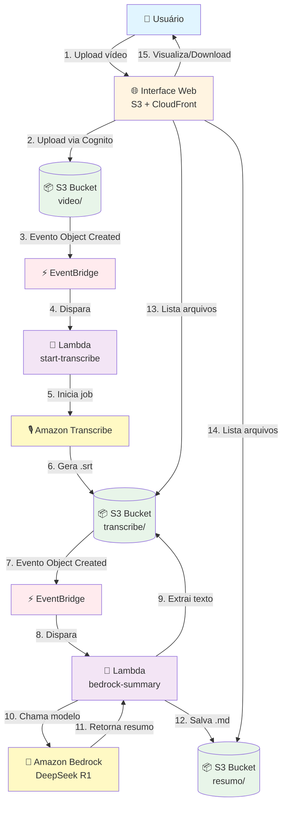
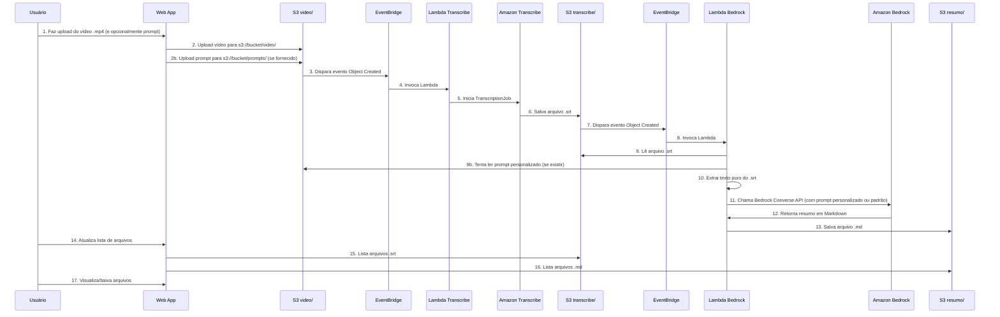

# AWS Community - Pipeline de Transcrição e Resumo Automatizado

Sistema completo para processamento automatizado de vídeos que gera transcrições e resumos usando serviços da AWS. O projeto permite upload de vídeos através de uma interface web, processamento automático via Amazon Transcribe e geração de resumos inteligentes usando Amazon Bedrock.

## 📋 Índice

- [Visão Geral](#visão-geral)
- [Arquitetura](#arquitetura)
- [Fluxo de Dados](#fluxo-de-dados)
- [Componentes](#componentes)
- [Requisitos](#requisitos)
- [Estrutura do Projeto](#estrutura-do-projeto)
- [Configuração](#configuração)
- [Deploy](#deploy)
- [Uso](#uso)
- [Scripts Disponíveis](#scripts-disponíveis)
- [Apresentação](#apresentação)

## 🎯 Visão Geral

Este projeto automatiza o processamento completo de vídeos educacionais e palestras:

1. **Upload de Vídeos**: Interface web para upload de arquivos `.mp4`
2. **Prompt Personalizado**: Opção de enviar prompt customizado para personalizar os resumos
3. **Transcrição Automática**: Geração de legendas `.srt` via Amazon Transcribe
4. **Resumo Inteligente**: Geração de resumos em Markdown via Amazon Bedrock (DeepSeek R1)
5. **Interface Web Moderna**: Visualização avançada de Markdown com suporte a tabelas, diagramas Mermaid e syntax highlighting

## 🏗️ Arquitetura

O sistema utiliza uma arquitetura serverless na AWS, composta por:

- **Frontend**: Aplicação web estática hospedada no S3 e distribuída via CloudFront
- **Autenticação**: Cognito Identity Pool para acesso não autenticado ao S3
- **Processamento**: Funções Lambda acionadas por eventos do S3
- **IA/ML**: Amazon Transcribe para transcrição e Amazon Bedrock para resumos
- **Armazenamento**: S3 para vídeos, transcrições e resumos
- **Orquestração**: EventBridge para coordenação de eventos

### Diagrama de Arquitetura



## 🔄 Fluxo de Dados

### Fluxo Completo



## 🧩 Componentes

### Frontend (Interface Web)

- **Localização**: `app/`
- **Tecnologias**: HTML5, CSS3, JavaScript (Vanilla)
- **Bibliotecas Externas**:
  - **Marked.js**: Renderização de Markdown
  - **Highlight.js**: Syntax highlighting para blocos de código
  - **DOMPurify**: Sanitização de HTML para segurança
  - **Mermaid.js**: Renderização de diagramas Mermaid
- **Hospedagem**: S3 + CloudFront
- **Layout**: Sidebar vertical à esquerda com preview à direita
- **Design**: Paleta monocromática (preto/cinza/branco)
- **Funcionalidades**:
  - Upload de vídeos `.mp4` via Cognito Identity Pool
  - Upload de prompt personalizado (`.txt` ou `.md`) - opcional
  - Listagem de transcrições `.srt` e resumos `.md`
  - Visualização avançada de Markdown com:
    - Suporte a GitHub Flavored Markdown (tabelas, task lists)
    - Diagramas Mermaid (flowcharts, sequence, gantt, etc.)
    - Syntax highlighting para código
    - Renderização de tabelas responsivas
  - Download de arquivos
  - Modo claro/escuro
  - Botões de ação integrados (Atualizar, Dark Mode)
  - Logo AWS Community Campinas no header

### Backend (Serverless)

#### Lambda: `start-transcribe-on-s3-upload`
- **Trigger**: EventBridge (quando arquivo `.mp4` é criado em `video/`)
- **Função**: Inicia job de transcrição no Amazon Transcribe
- **Output**: Arquivo `.srt` salvo em `transcribe/`

#### Lambda: `generate-summary-from-srt-bedrock`
- **Trigger**: EventBridge (quando arquivo `.srt` é criado em `transcribe/`)
- **Função**: 
  - Extrai texto puro do arquivo `.srt`
  - Tenta ler prompt personalizado do S3 (`prompts/{nome_video}.txt`)
  - Se não encontrar, usa prompt padrão hardcoded
  - Chama Amazon Bedrock (DeepSeek R1) para gerar resumo
  - Salva resumo em Markdown em `resumo/`

### Infraestrutura AWS

- **S3 Buckets**:
  - `aws-community-app`: Frontend estático
  - `aws-community-cps`: Vídeos, transcrições, resumos e prompts personalizados
    - `video/`: Arquivos de vídeo `.mp4`
    - `transcribe/`: Transcrições `.srt`
    - `resumo/`: Resumos `.md`
    - `prompts/`: Prompts personalizados `.txt` (opcional)
- **CloudFront**: CDN para distribuição do frontend
- **Route53**: DNS para domínio personalizado
- **ACM**: Certificado SSL/TLS
- **Cognito Identity Pool**: Autenticação para acesso ao S3
- **EventBridge**: Orquestração de eventos
- **IAM**: Políticas de permissão

## 📋 Requisitos

### Pré-requisitos

- **AWS CLI** configurado com credenciais válidas
- **Terraform** >= 1.6.0
- **Python** 3.12 (para desenvolvimento local)
- **Bash** (para scripts de deploy)
- **Conta AWS** com permissões para criar recursos

### Permissões AWS Necessárias

- Criar e gerenciar buckets S3
- Criar e gerenciar funções Lambda
- Criar e gerenciar EventBridge rules
- Criar e gerenciar Cognito Identity Pools
- Criar e gerenciar CloudFront distributions
- Criar e gerenciar Route53 records
- Acessar Amazon Transcribe
- Acessar Amazon Bedrock (com acesso ao modelo DeepSeek R1)

### Configuração do Bedrock

1. Acesse o console do Amazon Bedrock
2. Solicite acesso ao modelo **DeepSeek R1** (ou use outro modelo compatível)
3. Verifique que o inference profile `us.deepseek.r1-v1:0` está disponível

## 📁 Estrutura do Projeto

```
meetup/
├── app/                          # Frontend estático
│   ├── index.html               # Página principal
│   ├── app.js                   # Lógica JavaScript
│   ├── models.json              # Lista de modelos Bedrock para o seletor
│   ├── styles.css               # Estilos CSS
│   ├── error.html               # Página de erro 404
│   └── assets/
│       └── logo.svg             # Logo AWS Community Campinas
│
├── terraform/                    # Infraestrutura como código
│   ├── main.tf                  # Recursos principais
│   ├── variables.tf             # Variáveis
│   ├── outputs.tf               # Outputs (identity_pool_id, buckets, cloudfront_distribution_id)
│   ├── terraform.tfvars         # Valores (não versionado)
│   ├── lambda/
│   │   ├── lambda_function.py   # Lambda de transcrição
│   │   └── lambda_bedrock_summary.py  # Lambda de resumo
│   └── build/                   # ZIPs das Lambdas (gerados por build_lambdas.sh)
│
├── script/                       # Scripts de automação
│   ├── setup-acm-certificate.sh # Cria certificado ACM (us-east-1) via AWS CLI
│   ├── setup-iam-prereqs.sh     # Cria usuário IAM opcional para deploy
│   ├── update_app_config.sh    # Atualiza app.js com outputs do Terraform
│   ├── build_lambdas.sh         # Empacota as Lambdas
│   ├── terraform_deploy.sh      # terraform init + apply + update_app_config
│   ├── deploy_app.sh            # Sync S3 + invalidação CloudFront (ID via Terraform)
│   ├── clear_files.sh           # Limpeza de video/ e transcribe/ no S3
│   ├── destroy_all.sh          # Destrói toda a infra (terraform destroy)
│   └── prompt.md                # Exemplo de prompt para resumos
│
├── .gitignore
├── README.md
└── PRESENTATION.md              # Base para apresentação do projeto
```

## ⚙️ Configuração

### 1. Pré-requisitos AWS (opcional: scripts com AWS CLI)

Para simplificar a criação da infraestrutura, use os scripts que criam certificado e usuário IAM via AWS CLI:

**Certificado ACM (obrigatório para HTTPS no CloudFront)**  
O certificado deve estar em **us-east-1**. Com domínio e hosted zone no Route53:

```bash
export DOMAIN_NAME="meetup.ramalho.dev.br"
export HOSTED_ZONE_ID="Z1234567890ABC"   # ID da hosted zone do domínio
bash script/setup-acm-certificate.sh
```

O script exibe o `acm_certificate_arn`; adicione-o no `terraform.tfvars`. Se não usar `HOSTED_ZONE_ID`, valide o certificado manualmente no console ACM.

**Usuário IAM para deploy (opcional)**  
Para um usuário dedicado com permissões de deploy:

```bash
export DEPLOY_USER_NAME="aws-meetup-deploy"
bash script/setup-iam-prereqs.sh
```

Depois crie uma Access Key no console IAM e use `aws configure`.

### 2. Variáveis do Terraform

Crie `terraform/terraform.tfvars`:

```hcl
aws_region         = "us-east-2"
app_bucket_name    = "aws-community-app"
cps_bucket_name    = "aws-community-cps"
domain_name        = "meetup.ramalho.dev.br"
acm_certificate_arn = "arn:aws:acm:us-east-1:ACCOUNT_ID:certificate/CERT_ID"  # Saída do setup-acm-certificate.sh
hosted_zone_id     = "Z1234567890ABC"

bedrock_region            = "us-east-2"
bedrock_model_id          = "anthropic.claude-haiku-4-5-20251001-v1:0"
bedrock_inference_profile = ""   # Preencher para DeepSeek R1: "us.deepseek.r1-v1:0"
```

### 3. Configuração do Frontend

Após `terraform apply`, o script `update_app_config.sh` (executado por `terraform_deploy.sh` ou `deploy_app.sh`) atualiza automaticamente o `app.js` com `IdentityPoolId` e nome do bucket CPS. Se fizer deploy manual, rode:

```bash
bash script/update_app_config.sh
```

## 🚀 Deploy

### 1. Build das Lambdas

```bash
bash script/build_lambdas.sh
```

Este script:
- Cria o diretório `terraform/build/` se não existir
- Empacota as funções Lambda em arquivos ZIP

### 2. Deploy da Infraestrutura

```bash
bash script/terraform_deploy.sh
```

Ou manualmente:

```bash
cd terraform
terraform init
terraform plan
terraform apply
```

O script `terraform_deploy.sh` já roda `update_app_config.sh` ao final, atualizando o `app.js` com `identity_pool_id` e nome do bucket.

### 3. Deploy do Frontend

```bash
bash script/deploy_app.sh
```

Este script obtém o bucket do app e o ID do CloudFront dos outputs do Terraform, faz sync do `app/` para o S3 e invalida o cache do CloudFront. Execute `terraform apply` antes da primeira vez.

## 💻 Uso

### Acessando a Interface

Após o deploy, acesse o site através do domínio configurado (ex: `https://meetup.ramalho.dev.br`).

### Upload de Vídeo

1. Clique em "Choose File" e selecione um arquivo `.mp4`
2. (Opcional) Selecione um arquivo de prompt personalizado (`.txt` ou `.md`)
   - O prompt será usado para personalizar o resumo gerado
   - Se não enviar, será usado o prompt padrão
3. Clique em "Enviar"
4. Aguarde a confirmação de upload

### Processamento Automático

O processamento acontece automaticamente:

1. **Transcrição** (alguns minutos):
   - O vídeo é processado pelo Amazon Transcribe
   - Arquivo `.srt` é gerado e salvo em `transcribe/`

2. **Resumo** (alguns minutos após a transcrição):
   - O texto é extraído do `.srt`
   - Se um prompt personalizado foi enviado, ele é lido do S3 (`prompts/{nome_video}.txt`)
   - Caso contrário, é usado o prompt padrão
   - Resumo é gerado pelo Amazon Bedrock usando o prompt selecionado
   - Arquivo `.md` é salvo em `resumo/`

### Prompt Personalizado

Você pode personalizar os resumos enviando um arquivo de prompt junto com o vídeo:

- **Formato**: Arquivo de texto (`.txt` ou `.md`)
- **Nome**: O arquivo será salvo como `{nome_do_video}.txt` no bucket
- **Uso**: O prompt será usado como instrução para o modelo de IA ao gerar o resumo
- **Exemplo**: Um prompt pode instruir o modelo a focar em pontos técnicos, criar seções específicas, ou usar um formato particular

**Nota**: Se nenhum prompt for enviado, o sistema usa um prompt padrão otimizado para resumos de palestras e vídeos técnicos.

### Visualização

1. Use as abas "Transcrições (.srt)" e "Resumos (.md)" para alternar entre os tipos
2. Clique em um arquivo para visualizar o conteúdo
3. Os resumos Markdown suportam:
   - **Tabelas**: Renderização completa de tabelas GitHub Flavored Markdown
   - **Diagramas Mermaid**: Flowcharts, sequence diagrams, Gantt charts, etc.
   - **Syntax Highlighting**: Código com destaque de sintaxe
   - **Task Lists**: Listas de tarefas interativas
4. Use o botão "Baixar arquivo" para fazer download

## 🛠️ Scripts Disponíveis

| Script | Descrição |
|--------|-----------|
| `setup-acm-certificate.sh` | Cria certificado ACM em us-east-1 (variáveis: `DOMAIN_NAME`, opcional `HOSTED_ZONE_ID`). |
| `setup-iam-prereqs.sh` | Cria usuário IAM opcional para deploy (variável: `DEPLOY_USER_NAME`). |
| `update_app_config.sh` | Atualiza `app.js` com `identity_pool_id` e bucket CPS a partir dos outputs do Terraform. |
| `build_lambdas.sh` | Empacota as Lambdas em ZIP em `terraform/build/`. |
| `terraform_deploy.sh` | `terraform init` + `apply` + `update_app_config.sh`. |
| `deploy_app.sh` | Sync do `app/` para o S3 e invalidação do CloudFront (usa outputs do Terraform). |
| `clear_files.sh` | **⚠️ CUIDADO**: Apaga todos os arquivos em `video/` e `transcribe/` do bucket CPS. |
| `destroy_all.sh` | **⚠️ DESTRÓI TUDO**: Remove toda a infraestrutura com `terraform destroy`. Confirmação digitando `sim`; use `AUTO_APPROVE=1` para pular. |

Exemplos:

```bash
# Pré-requisitos (certificado e opcionalmente IAM)
DOMAIN_NAME=meetup.ramalho.dev.br HOSTED_ZONE_ID=Z... bash script/setup-acm-certificate.sh
DEPLOY_USER_NAME=aws-meetup-deploy bash script/setup-iam-prereqs.sh

# Deploy completo
bash script/build_lambdas.sh
bash script/terraform_deploy.sh
bash script/deploy_app.sh
```

## 📽️ Apresentação

O arquivo [PRESENTATION.md](PRESENTATION.md) contém uma base em Markdown para criação de slides (por exemplo, para meetups ou demos): visão geral, arquitetura, fluxo e passos de deploy.

## 🔧 Manutenção

### Atualizar Código das Lambdas

1. Edite os arquivos em `terraform/lambda/`
2. Execute `bash script/build_lambdas.sh`
3. Execute `terraform apply` na pasta `terraform/`

### Atualizar Frontend

1. Edite os arquivos em `app/`
2. Se adicionar novos assets, certifique-se de que estão na pasta `app/assets/`
3. Execute `bash script/deploy_app.sh`

### Verificar Logs

```bash
# Logs da Lambda de Transcrição
aws logs tail /aws/lambda/start-transcribe-on-s3-upload --follow

# Logs da Lambda de Resumo
aws logs tail /aws/lambda/generate-summary-from-srt-bedrock --follow
```

## 📊 Custos Estimados

Os custos variam conforme o uso, mas os principais componentes são:

- **S3**: Armazenamento e requisições (~$0.023/GB/mês)
- **Lambda**: Execuções e duração (~$0.20 por 1M requisições)
- **Transcribe**: Por minuto de áudio processado (~$0.024/minuto)
- **Bedrock**: Por token processado (varia por modelo)
- **CloudFront**: Transferência de dados (~$0.085/GB)
- **EventBridge**: Primeiros 14M eventos/mês são gratuitos

## 🔒 Segurança

- **Cognito Identity Pool**: Acesso não autenticado com permissões limitadas apenas aos prefixos necessários
- **IAM Policies**: Princípio do menor privilégio aplicado
- **S3 Bucket Policies**: Acesso público apenas para o bucket do frontend
- **CloudFront**: HTTPS obrigatório com certificado SSL/TLS
- **Variáveis Sensíveis**: Armazenadas em variáveis de ambiente das Lambdas

## 🐛 Troubleshooting

### Erro no Upload

- Verifique se o `IdentityPoolId` no `app.js` está correto
- Verifique as permissões do Cognito Identity Pool
- Verifique os logs do navegador (F12)

### Transcrição não é gerada

- Verifique os logs da Lambda `start-transcribe-on-s3-upload`
- Verifique se o EventBridge está configurado corretamente
- Verifique se o Amazon Transcribe tem acesso ao bucket

### Resumo não é gerado

- Verifique os logs da Lambda `generate-summary-from-srt-bedrock`
- Verifique se o acesso ao Bedrock está habilitado
- Verifique se o inference profile está correto
- Verifique se o prompt personalizado (se usado) está no formato correto e no bucket correto

### Site não carrega

- Verifique se o CloudFront está distribuindo corretamente
- Verifique se o certificado SSL está válido
- Verifique os logs do CloudFront

## 📝 Licença

Este projeto é fornecido como está, sem garantias.

## 🤝 Contribuindo

Contribuições são bem-vindas! Sinta-se à vontade para abrir issues ou pull requests.

## 📧 Contato

**Autor:** Marcos Ramalho

**E-mail:** mramalho@gmail.com

**LinkedIn:** [www.linkedin.com/in/ramalho.dev](https://www.linkedin.com/in/ramalho.dev)

---

**Desenvolvido com ❤️ usando AWS Serverless**


