# AWS Community - Pipeline de Transcrição e Resumo Automatizado

Sistema completo para processamento automatizado de vídeos que gera transcrições e resumos usando serviços da AWS. O projeto permite upload de vídeos através de uma interface web, processamento automático via Amazon Transcribe e geração de resumos inteligentes usando Amazon Bedrock.

## 📋 Índice

- [Visão Geral](#visão-geral)
- [Arquitetura](#arquitetura)
- [Fluxo de Dados](#fluxo-de-dados)
- [Componentes](#componentes)
- [Requisitos](#requisitos)
- [Estrutura do Projeto](#estrutura-do-projeto)
- [Configuração](#configuração)
- [Deploy](#deploy)
- [Uso](#uso)
- [Scripts Disponíveis](#scripts-disponíveis)

## 🎯 Visão Geral

Este projeto automatiza o processamento completo de vídeos educacionais e palestras:

1. **Upload de Vídeos**: Interface web para upload de arquivos `.mp4`
2. **Prompt Personalizado**: Opção de enviar prompt customizado para personalizar os resumos
3. **Transcrição Automática**: Geração de legendas `.srt` via Amazon Transcribe
4. **Resumo Inteligente**: Geração de resumos em Markdown via Amazon Bedrock (DeepSeek R1)
5. **Interface Web Moderna**: Visualização avançada de Markdown com suporte a tabelas, diagramas Mermaid e syntax highlighting

## 🏗️ Arquitetura

O sistema utiliza uma arquitetura serverless na AWS, composta por:

- **Frontend**: Aplicação web estática hospedada no S3 e distribuída via CloudFront
- **Autenticação**: Cognito Identity Pool para acesso não autenticado ao S3
- **Processamento**: Funções Lambda acionadas por eventos do S3
- **IA/ML**: Amazon Transcribe para transcrição e Amazon Bedrock para resumos
- **Armazenamento**: S3 para vídeos, transcrições e resumos
- **Orquestração**: EventBridge para coordenação de eventos

### Diagrama de Arquitetura

```mermaid
graph TB
    User[👤 Usuário] -->|1. Upload vídeo| WebApp[🌐 Interface Web<br/>S3 + CloudFront]
    WebApp -->|2. Upload via Cognito| S3Video[(📦 S3 Bucket<br/>video/)]
    
    S3Video -->|3. Evento Object Created| EventBridge[⚡ EventBridge]
    EventBridge -->|4. Dispara| LambdaTranscribe[🔷 Lambda<br/>start-transcribe]
    
    LambdaTranscribe -->|5. Inicia job| Transcribe[🎙️ Amazon Transcribe]
    Transcribe -->|6. Gera .srt| S3Transcribe[(📦 S3 Bucket<br/>transcribe/)]
    
    S3Transcribe -->|7. Evento Object Created| EventBridge2[⚡ EventBridge]
    EventBridge2 -->|8. Dispara| LambdaBedrock[🔷 Lambda<br/>bedrock-summary]
    
    LambdaBedrock -->|9. Extrai texto| S3Transcribe
    LambdaBedrock -->|10. Chama modelo| Bedrock[🤖 Amazon Bedrock<br/>DeepSeek R1]
    Bedrock -->|11. Retorna resumo| LambdaBedrock
    LambdaBedrock -->|12. Salva .md| S3Resumo[(📦 S3 Bucket<br/>resumo/)]
    
    WebApp -->|13. Lista arquivos| S3Transcribe
    WebApp -->|14. Lista arquivos| S3Resumo
    WebApp -->|15. Visualiza/Download| User
    
    style User fill:#e1f5ff
    style WebApp fill:#fff4e1
    style S3Video fill:#e8f5e9
    style S3Transcribe fill:#e8f5e9
    style S3Resumo fill:#e8f5e9
    style LambdaTranscribe fill:#f3e5f5
    style LambdaBedrock fill:#f3e5f5
    style Transcribe fill:#fff9c4
    style Bedrock fill:#fff9c4
    style EventBridge fill:#ffebee
    style EventBridge2 fill:#ffebee
```



## 🔄 Fluxo de Dados

### Fluxo Completo

```mermaid
sequenceDiagram
    participant U as Usuário
    participant W as Web App
    participant S3V as S3 video/
    participant EB1 as EventBridge
    participant LT as Lambda Transcribe
    participant TR as Amazon Transcribe
    participant S3T as S3 transcribe/
    participant EB2 as EventBridge
    participant LB as Lambda Bedrock
    participant BR as Amazon Bedrock
    participant S3R as S3 resumo/

    U->>W: 1. Faz upload do vídeo .mp4 (e opcionalmente prompt)
    W->>S3V: 2. Upload vídeo para s3://bucket/video/
    W->>S3V: 2b. Upload prompt para s3://bucket/prompts/ (se fornecido)
    S3V->>EB1: 3. Dispara evento Object Created
    EB1->>LT: 4. Invoca Lambda
    LT->>TR: 5. Inicia TranscriptionJob
    TR->>S3T: 6. Salva arquivo .srt
    S3T->>EB2: 7. Dispara evento Object Created
    EB2->>LB: 8. Invoca Lambda
    LB->>S3T: 9. Lê arquivo .srt
    LB->>S3V: 9b. Tenta ler prompt personalizado (se existir)
    LB->>LB: 10. Extrai texto puro do .srt
    LB->>BR: 11. Chama Bedrock Converse API (com prompt personalizado ou padrão)
    BR->>LB: 12. Retorna resumo em Markdown
    LB->>S3R: 13. Salva arquivo .md
    U->>W: 14. Atualiza lista de arquivos
    W->>S3T: 15. Lista arquivos .srt
    W->>S3R: 16. Lista arquivos .md
    U->>W: 17. Visualiza/baixa arquivos
```



## 🧩 Componentes

### Frontend (Interface Web)

- **Localização**: `app/`
- **Tecnologias**: HTML5, CSS3, JavaScript (Vanilla)
- **Bibliotecas Externas**:
  - **Marked.js**: Renderização de Markdown
  - **Highlight.js**: Syntax highlighting para blocos de código
  - **DOMPurify**: Sanitização de HTML para segurança
  - **Mermaid.js**: Renderização de diagramas Mermaid
- **Hospedagem**: S3 + CloudFront
- **Layout**: Sidebar vertical à esquerda com preview à direita
- **Design**: Paleta monocromática (preto/cinza/branco)
- **Funcionalidades**:
  - Upload de vídeos `.mp4` via Cognito Identity Pool
  - Upload de prompt personalizado (`.txt` ou `.md`) - opcional
  - Listagem de transcrições `.srt` e resumos `.md`
  - Visualização avançada de Markdown com:
    - Suporte a GitHub Flavored Markdown (tabelas, task lists)
    - Diagramas Mermaid (flowcharts, sequence, gantt, etc.)
    - Syntax highlighting para código
    - Renderização de tabelas responsivas
  - Download de arquivos
  - Modo claro/escuro
  - Botões de ação integrados (Atualizar, Dark Mode)
  - Logo AWS Community Campinas no header

### Backend (Serverless)

#### Lambda: `start-transcribe-on-s3-upload`
- **Trigger**: EventBridge (quando arquivo `.mp4` é criado em `video/`)
- **Função**: Inicia job de transcrição no Amazon Transcribe
- **Output**: Arquivo `.srt` salvo em `transcribe/`

#### Lambda: `generate-summary-from-srt-bedrock`
- **Trigger**: EventBridge (quando arquivo `.srt` é criado em `transcribe/`)
- **Função**: 
  - Extrai texto puro do arquivo `.srt`
  - Tenta ler prompt personalizado do S3 (`prompts/{nome_video}.txt`)
  - Se não encontrar, usa prompt padrão hardcoded
  - Chama Amazon Bedrock (DeepSeek R1) para gerar resumo
  - Salva resumo em Markdown em `resumo/`

### Infraestrutura AWS

- **S3 Buckets**:
  - `aws-community-app`: Frontend estático
  - `aws-community-cps`: Vídeos, transcrições, resumos e prompts personalizados
    - `video/`: Arquivos de vídeo `.mp4`
    - `transcribe/`: Transcrições `.srt`
    - `resumo/`: Resumos `.md`
    - `prompts/`: Prompts personalizados `.txt` (opcional)
- **CloudFront**: CDN para distribuição do frontend
- **Route53**: DNS para domínio personalizado
- **ACM**: Certificado SSL/TLS
- **Cognito Identity Pool**: Autenticação para acesso ao S3
- **EventBridge**: Orquestração de eventos
- **IAM**: Políticas de permissão

## 📋 Requisitos

### Pré-requisitos

- **AWS CLI** configurado com credenciais válidas
- **Terraform** >= 1.6.0
- **Python** 3.12 (para desenvolvimento local)
- **Bash** (para scripts de deploy)
- **Conta AWS** com permissões para criar recursos

### Permissões AWS Necessárias

- Criar e gerenciar buckets S3
- Criar e gerenciar funções Lambda
- Criar e gerenciar EventBridge rules
- Criar e gerenciar Cognito Identity Pools
- Criar e gerenciar CloudFront distributions
- Criar e gerenciar Route53 records
- Acessar Amazon Transcribe
- Acessar Amazon Bedrock (com acesso ao modelo DeepSeek R1)

### Configuração do Bedrock

1. Acesse o console do Amazon Bedrock
2. Solicite acesso ao modelo **DeepSeek R1** (ou use outro modelo compatível)
3. Verifique que o inference profile `us.deepseek.r1-v1:0` está disponível

## 📁 Estrutura do Projeto

```
meetup/
├── app/                          # Frontend estático
│   ├── index.html               # Página principal
│   ├── app.js                   # Lógica JavaScript
│   ├── styles.css               # Estilos CSS
│   ├── error.html               # Página de erro 404
│   └── assets/                  # Assets estáticos
│       └── logo.svg             # Logo AWS Community Campinas
│
├── terraform/                    # Infraestrutura como código
│   ├── main.tf                  # Recursos principais
│   ├── variables.tf             # Variáveis do Terraform
│   ├── outputs.tf               # Outputs do Terraform
│   ├── terraform.tfvars         # Valores das variáveis (não versionado)
│   ├── lambda/                  # Código das Lambdas
│   │   ├── lambda_function.py   # Lambda de transcrição
│   │   └── lambda_bedrock_summary.py  # Lambda de resumo
│   └── build/                   # Arquivos ZIP das Lambdas
│       ├── start_transcribe.zip
│       └── bedrock_summary.zip
│
├── script/                       # Scripts de automação
│   ├── build_lambdas.sh         # Build das Lambdas
│   ├── deploy_app.sh            # Deploy do frontend
│   ├── terraform_deploy.sh      # Deploy da infraestrutura
│   └── clear_files.sh           # Limpeza de arquivos S3
│
├── .gitignore                   # Arquivos ignorados pelo Git
└── README.md                    # Este arquivo
```

## ⚙️ Configuração

### 1. Variáveis do Terraform

Crie um arquivo `terraform/terraform.tfvars` com suas configurações:

```hcl
aws_region = "us-east-2"

app_bucket_name = "aws-community-app"
cps_bucket_name = "aws-community-cps"

domain_name = "meetup.ramalho.dev.br"

# Certificado ACM (deve estar em us-east-1 para CloudFront)
acm_certificate_arn = "arn:aws:acm:us-east-1:ACCOUNT_ID:certificate/CERT_ID"

# Hosted Zone do Route53
hosted_zone_id = "Z1234567890ABC"

# Configurações do Bedrock
bedrock_region = "us-east-2"
bedrock_model_id = "deepseek.r1-v1:0"
bedrock_inference_profile = "us.deepseek.r1-v1:0"
```

### 2. Configuração do Frontend

Atualize o `IdentityPoolId` no arquivo `app/app.js` após o deploy do Terraform:

```javascript
AWS.config.update({
  region: "us-east-2",
  credentials: new AWS.CognitoIdentityCredentials({
    IdentityPoolId: "us-east-2:SEU_IDENTITY_POOL_ID"  // Obtenha do output do Terraform
  })
});
```

## 🚀 Deploy

### 1. Build das Lambdas

```bash
bash script/build_lambdas.sh
```

Este script:
- Cria o diretório `terraform/build/` se não existir
- Empacota as funções Lambda em arquivos ZIP

### 2. Deploy da Infraestrutura

```bash
bash script/terraform_deploy.sh
```

Ou manualmente:

```bash
cd terraform
terraform init
terraform plan
terraform apply
```

**Importante**: Anote o `identity_pool_id` do output do Terraform e atualize o `app.js`.

### 3. Deploy do Frontend

```bash
bash script/deploy_app.sh
```

Este script:
- Faz sync dos arquivos do `app/` para o bucket S3
- Invalida o cache do CloudFront

## 💻 Uso

### Acessando a Interface

Após o deploy, acesse o site através do domínio configurado (ex: `https://meetup.ramalho.dev.br`).

### Upload de Vídeo

1. Clique em "Choose File" e selecione um arquivo `.mp4`
2. (Opcional) Selecione um arquivo de prompt personalizado (`.txt` ou `.md`)
   - O prompt será usado para personalizar o resumo gerado
   - Se não enviar, será usado o prompt padrão
3. Clique em "Enviar"
4. Aguarde a confirmação de upload

### Processamento Automático

O processamento acontece automaticamente:

1. **Transcrição** (alguns minutos):
   - O vídeo é processado pelo Amazon Transcribe
   - Arquivo `.srt` é gerado e salvo em `transcribe/`

2. **Resumo** (alguns minutos após a transcrição):
   - O texto é extraído do `.srt`
   - Se um prompt personalizado foi enviado, ele é lido do S3 (`prompts/{nome_video}.txt`)
   - Caso contrário, é usado o prompt padrão
   - Resumo é gerado pelo Amazon Bedrock usando o prompt selecionado
   - Arquivo `.md` é salvo em `resumo/`

### Prompt Personalizado

Você pode personalizar os resumos enviando um arquivo de prompt junto com o vídeo:

- **Formato**: Arquivo de texto (`.txt` ou `.md`)
- **Nome**: O arquivo será salvo como `{nome_do_video}.txt` no bucket
- **Uso**: O prompt será usado como instrução para o modelo de IA ao gerar o resumo
- **Exemplo**: Um prompt pode instruir o modelo a focar em pontos técnicos, criar seções específicas, ou usar um formato particular

**Nota**: Se nenhum prompt for enviado, o sistema usa um prompt padrão otimizado para resumos de palestras e vídeos técnicos.

### Visualização

1. Use as abas "Transcrições (.srt)" e "Resumos (.md)" para alternar entre os tipos
2. Clique em um arquivo para visualizar o conteúdo
3. Os resumos Markdown suportam:
   - **Tabelas**: Renderização completa de tabelas GitHub Flavored Markdown
   - **Diagramas Mermaid**: Flowcharts, sequence diagrams, Gantt charts, etc.
   - **Syntax Highlighting**: Código com destaque de sintaxe
   - **Task Lists**: Listas de tarefas interativas
4. Use o botão "Baixar arquivo" para fazer download

## 🛠️ Scripts Disponíveis

### `build_lambdas.sh`
Empacota as funções Lambda em arquivos ZIP para deploy.

```bash
bash script/build_lambdas.sh
```

### `deploy_app.sh`
Faz deploy do frontend para o S3 e invalida o cache do CloudFront.

```bash
bash script/deploy_app.sh
```

### `terraform_deploy.sh`
Inicializa e aplica a infraestrutura com Terraform.

```bash
bash script/terraform_deploy.sh
```

### `clear_files.sh`
**⚠️ CUIDADO**: Apaga todos os arquivos dos diretórios `video/` e `transcribe/` do bucket S3.

```bash
bash script/clear_files.sh
```

## 🔧 Manutenção

### Atualizar Código das Lambdas

1. Edite os arquivos em `terraform/lambda/`
2. Execute `bash script/build_lambdas.sh`
3. Execute `terraform apply` na pasta `terraform/`

### Atualizar Frontend

1. Edite os arquivos em `app/`
2. Se adicionar novos assets, certifique-se de que estão na pasta `app/assets/`
3. Execute `bash script/deploy_app.sh`

### Verificar Logs

```bash
# Logs da Lambda de Transcrição
aws logs tail /aws/lambda/start-transcribe-on-s3-upload --follow

# Logs da Lambda de Resumo
aws logs tail /aws/lambda/generate-summary-from-srt-bedrock --follow
```

## 📊 Custos Estimados

Os custos variam conforme o uso, mas os principais componentes são:

- **S3**: Armazenamento e requisições (~$0.023/GB/mês)
- **Lambda**: Execuções e duração (~$0.20 por 1M requisições)
- **Transcribe**: Por minuto de áudio processado (~$0.024/minuto)
- **Bedrock**: Por token processado (varia por modelo)
- **CloudFront**: Transferência de dados (~$0.085/GB)
- **EventBridge**: Primeiros 14M eventos/mês são gratuitos

## 🔒 Segurança

- **Cognito Identity Pool**: Acesso não autenticado com permissões limitadas apenas aos prefixos necessários
- **IAM Policies**: Princípio do menor privilégio aplicado
- **S3 Bucket Policies**: Acesso público apenas para o bucket do frontend
- **CloudFront**: HTTPS obrigatório com certificado SSL/TLS
- **Variáveis Sensíveis**: Armazenadas em variáveis de ambiente das Lambdas

## 🐛 Troubleshooting

### Erro no Upload

- Verifique se o `IdentityPoolId` no `app.js` está correto
- Verifique as permissões do Cognito Identity Pool
- Verifique os logs do navegador (F12)

### Transcrição não é gerada

- Verifique os logs da Lambda `start-transcribe-on-s3-upload`
- Verifique se o EventBridge está configurado corretamente
- Verifique se o Amazon Transcribe tem acesso ao bucket

### Resumo não é gerado

- Verifique os logs da Lambda `generate-summary-from-srt-bedrock`
- Verifique se o acesso ao Bedrock está habilitado
- Verifique se o inference profile está correto
- Verifique se o prompt personalizado (se usado) está no formato correto e no bucket correto

### Site não carrega

- Verifique se o CloudFront está distribuindo corretamente
- Verifique se o certificado SSL está válido
- Verifique os logs do CloudFront

## 📝 Licença

Este projeto é fornecido como está, sem garantias.

## 🤝 Contribuindo

Contribuições são bem-vindas! Sinta-se à vontade para abrir issues ou pull requests.

## 📧 Contato

**Autor:** Marcos Ramalho

**E-mail:** mramalho@gmail.com

**LinkedIn:** [www.linkedin.com/in/ramalho.dev](https://www.linkedin.com/in/ramalho.dev)

---

**Desenvolvido com ❤️ usando AWS Serverless**


